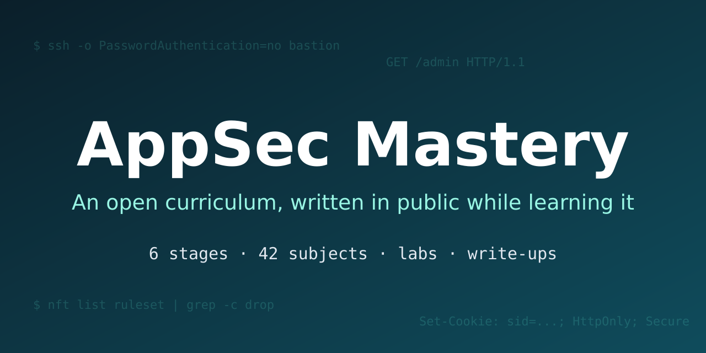

  

<h1 align="center">AppSec Mastery</h1>

  An open application-security curriculum, written in public while I learn it. 
  6 stages · 42 project-style subjects · lessons, lab write-ups and solutions

  <a href="https://YOUR_GITHUB_USERNAME.github.io/appsec-mastery/"><b>Read the site</b></a> ·
  <a href="https://YOUR_GITHUB_USERNAME.github.io/appsec-mastery/roadmap/">Roadmap</a> ·
  <a href="CONTRIBUTING.md">Contribute</a>

  
  
  

## What this is

A learner's notebook turned into a curriculum. Each of the 42 subjects is a project-style specification (mandatory part,
forbidden list, bonus, capstone, defense questions). While I study a subject I publish the lessons I write, my lab
write-ups and my solutions, all in the open. Mistakes get corrected publicly.

It is not written by a certified expert, and it says so. Treat it as a second opinion, verify what matters, and tell me when I am wrong.

## Progress

Computed from what is actually published, not hand-edited.

<!-- roadmap:start -->
| Stage | Subjects | Lessons published | Status |
|---|---|---|---|
| [Stage 0: Foundations Reset](docs/stage-0-foundations-reset/index.md) | 6 | 0 | Planned |
| [Stage 1: Security Fundamentals](docs/stage-1-security-fundamentals/index.md) | 7 | 0 | Planned |
| [Stage 2: Hands-On Web Security and Code Review](docs/stage-2-hands-on-web-security/index.md) | 7 | 0 | Planned |
| [Stage 3: Secure Development and AppSec Engineering](docs/stage-3-appsec-engineering/index.md) | 9 | 0 | Planned |
| [Stage 4: Real-World Readiness and Portfolio](docs/stage-4-real-world-readiness/index.md) | 6 | 0 | Planned |
| [Stage 5: Advanced Specialization](docs/stage-5-advanced-specialization/index.md) | 7 | 0 | Planned |

0 of 42 subjects complete · 0 lessons published. Full table: [roadmap](docs/roadmap.md).
<!-- roadmap:end -->

## How to use it

1. Read the subject.
2. Try it yourself in your own repository, on your own lab.
3. Read the lessons to check and deepen your understanding.
4. Answer the defense questions from memory.
5. Compare with my solutions last.

Details: [How to use this site](docs/how-to-use.md).

## How it is made

- Markdown in `docs/`, built with [MkDocs Material](https://squidfunk.github.io/mkdocs-material/) and published with GitHub Pages.
- `python tools/curriculum.py refresh` regenerates the roadmap, status blocks and navigation from the published files.
- Files starting with `_` are drafts and are not published.
- Every commit is scanned for secrets (`tools/scan_secrets.py`), locally by a pre-commit hook and in CI.

The subject specifications were drafted with AI assistance and edited by me. Lessons, write-ups, solutions and notes are mine.
See [About](docs/about.md).

## Contributing

Corrections are the most valuable contribution. See [CONTRIBUTING.md](CONTRIBUTING.md).

## Responsible use

Practice only on systems you own or are explicitly authorized to test. See [Responsible use](docs/ethics.md).

## License

Written content: [CC BY-SA 4.0](LICENSE-CONTENT.md). Code: [MIT](LICENSE).

This project is independent and is not affiliated with, endorsed by, or connected to 42, 1337, OffSec or any certification body.
